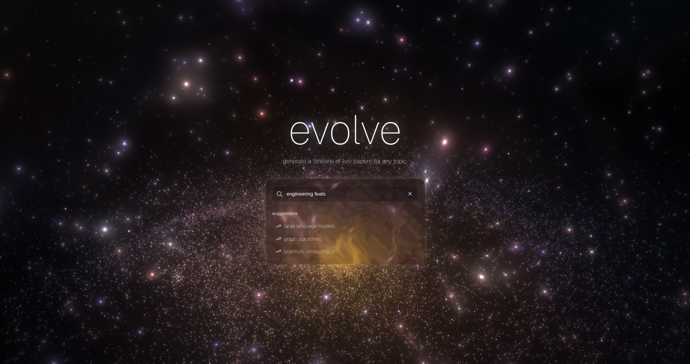
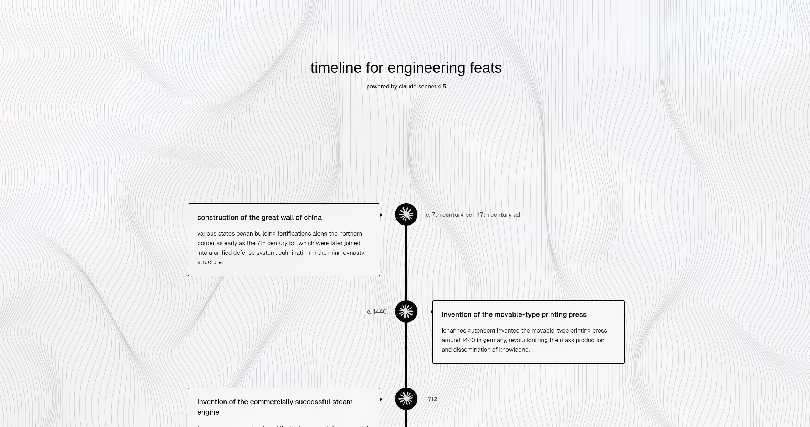

# evolve

an interactive timeline generator that tells the story of anything. click on the gif below for a full demo on [youtube](https://www.youtube.com/watch?v=N8VTFyMq1U0)!

  
    
  
    
  

## about

### what it does

evolve generates a clean, interactive timeline for any topic you throw at it. you type something in, and our backend, powered by sonnet 4.5, builds a chronological story with key events. by default, it uses a single-pass generation for speed, but users can enable our multi-stage verification pipeline if they want more thoroughly vetted sources. the best part? the links actually work. we made sure of it. also the ui is nice.

... read more on the [devpost](chill)!